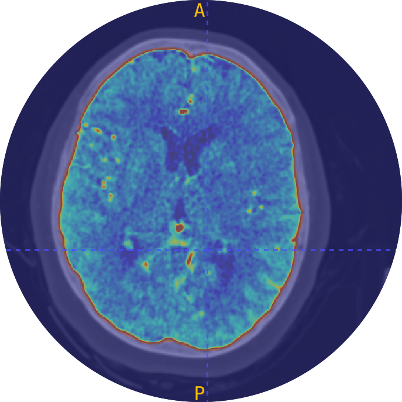
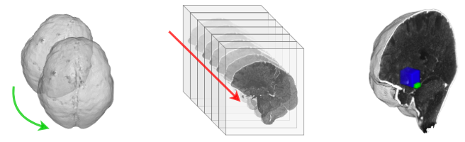

<div align="center">

  <!-- headline -->
  <center><h1> CT-Manager</h1></center>

</div>

A Python project for CT data extraction and preprocessing with Ni-Dataset package:
> [Ni-Dataset documentation](https://giuliorusso.github.io/Ni-Dataset/) <br>
> [Ni-Dataset official repository](https://github.com/GiulioRusso/Ni-Dataset)

<br>

## 📲 Installation and Configuration

1. Install requirements:

```bash
pip3 install -r requirements.txt
```

   Install the FSL library (only required for skull stripping task).

2. Edit configuration files in `configs/` with your parameters and dataset paths:
   - `parameters.yaml`: Set task, dataset, and output folder.
   - `paths.yaml`: Define paths to your data.

## 🛠️ Usage

The `main.py` script is the only executable pipeline of the project. It will:
1. Read configuration from `configs/parameters.yaml` and overload the specified parameters via argument parsing.
2. Load dataset paths from `configs/paths.yaml`.
3. Execute the specified task.
4. Save results to the output folder.

```bash
python3 main.py 
--dataset=<dataset_name> 
--task=<task_name> 
--output_folder=<folder_name>
```

**Example:**
```bash
python3 main.py --dataset=my_dataset --task=extract_slices --output_folder=slices
```

**Available tasks:**
- `extract_slices`: Extract 2D slices from 3D images.
- `extract_masks`: Extract 2D slices from 3D masks.
- `extract_annotations`: Extract 2D annotations.
- `debug_draw`: Visualize annotations on images.
- `skulling`: Remove skull from brain CT (requires FSL).
- `registration`: Register images to the specified template.
- `mip`: Apply Maximum-Intensity-Projection.
- `resampling`: Resample CTs to a target volume.
- `qc_check`: Quality control on a single NIfTI volume (geometry, data integrity, orientations).
- `qc_dataset`: Quality control on entire dataset folder with cross-file coherence analysis.

## 🔍 Quality Control (QC)

CT-Manager integrates **nidataset.qc** (v0.7.0+) to catch silent dataset bugs that poison ML training:

**What it checks:**
- **Geometry**: Affine matrices, orientation (RAS vs LAS), spacing isotropy
- **Data integrity**: NaN/Inf values, dtype issues, all-zero volumes
- **Pair/triple coherence**: Image↔mask alignment, annotations within masks

**Single volume QC:**
```bash
python3 main.py --task=qc_check --dataset=my_dataset
```

**Dataset-wide QC (detects outliers):**
```bash
python3 main.py --task=qc_dataset --dataset=my_dataset --output_folder=qc_reports
```

**Output:** JSON report with per-file checks + dataset distributions (orientation, spacing, dtype counts and outliers).

**Example report snippet:**
```
Dataset QC: 142 items
Status: warning
Summary: {'ok': 138, 'warning': 4, 'error': 0}

Distributions:
  orientation: {'RAS': 140, 'LAS': 2}
  dtype: {'uint8': 142}
  orientation outliers: ['scan_042.nii.gz', 'scan_089.nii.gz']
```

## ⚠️ Troubleshooting

- **Version mismatch:** Ensure `nidataset >= 0.7.0` is installed. Check with `pip list | grep nidataset`.
- **Skulling task issues:** Run from terminal instead of IDE. Ensure input paths contain no spaces. Verify FSL is installed and accessible in `PATH`.
- **Registration failures:** Check the template paths in `paths.yaml`. Verify input images are valid NIfTI format and ensure sufficient disk space for output.
- **QC task issues:** For `qc_dataset`, provide either a folder of NIfTI files or a CSV manifest (columns: `image,mask[,annotation]`). JSON reports are saved to `output_folder/qc_*_report.json`.